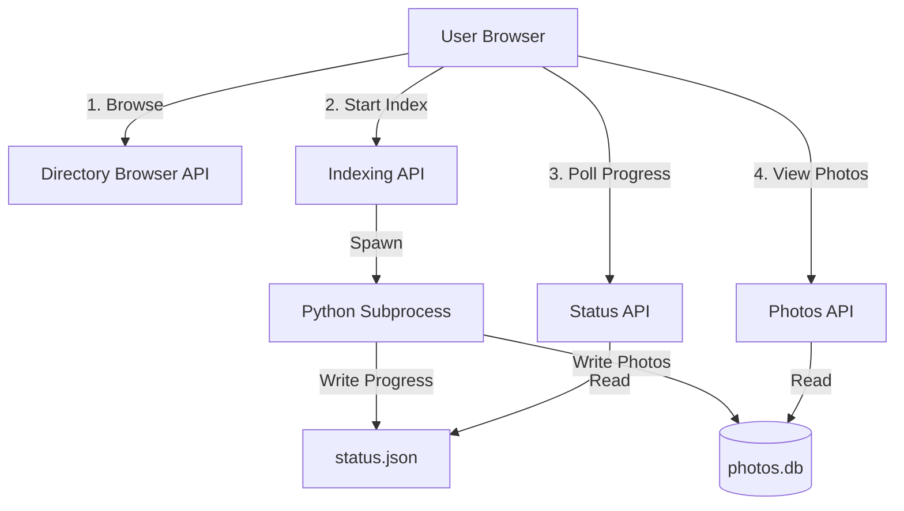

# Directory Browser with Live Indexing

## Architecture Overview




## Implementation Plan

### 1. Backend: Directory Browser API

**File: [`server.py`](server.py)**Add endpoints to browse server-side directories:

- `GET /api/directories?path=/path/to/dir` - List subdirectories and basic info (photo count estimate)
- `GET /api/directories/home` - Get user's home directory path as starting point
- Security: Restrict browsing to user's home directory and common photo locations
```python
@app.get("/api/directories")
def browse_directories(path: str = Query(...)):
    # Validate path is within allowed locations
    # Return: {
    #   'current': str,
    #   'parent': str | None,
    #   'directories': [{name, path, photo_count_estimate}]
    # }
```


### 2. Backend: Indexing Control API

**File: [`server.py`](server.py)**Add endpoints to manage background indexing:

- `POST /api/index/start?directory=/path` - Spawn subprocess to run indexer
- `GET /api/index/status` - Read current indexing progress
- `POST /api/index/cancel` - Terminate running indexer subprocess

Store indexing state in `indexing_status.json`:

```json
{
  "active": true,
  "directory": "/path/to/photos",
  "pid": 12345,
  "started_at": "2024-01-01T12:00:00",
  "progress": {
    "phase": "scanning|embedding|clustering|faces",
    "current": 150,
    "total": 500,
    "percent": 30,
    "message": "Processing photo 150 of 500"
  }
}
```

Implementation approach:

```python
import subprocess
import json

# Start indexing
process = subprocess.Popen([
    'python', 'index_photos.py',
    '--base-dir', directory,
    '--progress-file', 'indexing_status.json'
], stdout=subprocess.PIPE, stderr=subprocess.PIPE)

# Save PID for tracking/cancellation
```


### 3. Backend: Modify Indexer for Progress Reporting

**File: [`index_photos.py`](index_photos.py)**Add `--progress-file` argument and write progress updates:

```python
def update_progress(phase, current, total, message):
    if not PROGRESS_FILE:
        return
    
    progress_data = {
        'active': True,
        'directory': str(BASE_DIR),
        'pid': os.getpid(),
        'started_at': START_TIME,
        'progress': {
            'phase': phase,
            'current': current,
            'total': total,
            'percent': int((current / total * 100) if total else 0),
            'message': message
        }
    }
    
    with open(PROGRESS_FILE, 'w') as f:
        json.dump(progress_data, f)
```

Inject progress updates at key points:

- After scanning each photo (phase: 'scanning')
- After computing each embedding (phase: 'embedding')
- During clustering (phase: 'clustering')
- During face detection (phase: 'faces')

Commit photos to database incrementally (every 10-20 photos) so they appear in UI immediately.

### 4. Frontend: Directory Browser Modal

**File: [`static/index.html`](static/index.html)**Add new modal for directory selection:

```html
<div class="modal" id="directory-browser-modal">
  <div class="modal-content">
    <h2>Select Photo Directory</h2>
    <div class="breadcrumb" id="dir-breadcrumb"></div>
    <div class="directory-list" id="directory-list">
      <!-- Folders populated dynamically -->
    </div>
    <button id="select-directory-btn">Index This Directory</button>
  </div>
</div>
```


### 5. Frontend: Indexing Progress UI

**File: [`static/index.html`](static/index.html)**Add progress banner that appears during indexing:

```html
<div class="indexing-banner" id="indexing-banner">
  <div class="indexing-info">
    <span class="indexing-phase">Scanning photos...</span>
    <span class="indexing-progress">150 / 500 (30%)</span>
  </div>
  <div class="progress-bar-container">
    <div class="progress-bar-fill" id="indexing-progress-bar"></div>
  </div>
  <button class="cancel-btn">Cancel</button>
</div>
```


### 6. Frontend: Real-time Updates

**File: [`static/app.js`](static/app.js)**Add polling mechanism for live updates:

```javascript
// Poll indexing status every 2 seconds
async function pollIndexingStatus() {
  const status = await api.getIndexingStatus();
  
  if (status.active) {
    updateIndexingUI(status.progress);
    
    // Refresh photo grid to show newly indexed photos
    if (status.progress.current > lastSeenCount) {
      await loadClusters(true); // Append new photos
      lastSeenCount = status.progress.current;
    }
    
    setTimeout(pollIndexingStatus, 2000);
  } else {
    hideIndexingUI();
    await loadClusters(); // Full reload when complete
  }
}
```


### 7. Frontend: API Integration

**File: [`static/app.js`](static/app.js)**Add new API methods:

```javascript
const api = {
  async browseDirectories(path) { ... },
  async startIndexing(directory) { ... },
  async getIndexingStatus() { ... },
  async cancelIndexing() { ... }
}
```


### 8. UI/UX Flow

**Initial State:**

- Header shows "No photos indexed" message
- Button: "Browse & Index Photos"

**Browsing Flow:**

1. Click "Browse & Index Photos"
2. Modal opens showing home directory
3. Navigate through folders
4. See estimated photo counts per folder
5. Click "Index This Directory"

**Indexing Flow:**

1. Banner appears at top: "Indexing /path/to/photos..."
2. Progress bar shows real-time updates
3. Photos appear in grid as they're indexed (no waiting)
4. User can browse/star photos while indexing continues
5. When complete, banner fades out

**Subsequent Use:**

- Database selector (existing) allows switching between indexed collections
- "Add More Photos" button to index additional directories

## Files to Modify

1. [`server.py`](server.py) - Add directory browsing, indexing control APIs
2. [`index_photos.py`](index_photos.py) - Add progress reporting, incremental commits
3. [`static/index.html`](static/index.html) - Add directory browser modal, progress banner
4. [`static/app.js`](static/app.js) - Add polling, directory browser logic
5. [`static/style.css`](static/style.css) - Style directory browser and progress UI

## Security Considerations

- Restrict directory browsing to safe locations (home directory, /Volumes on macOS)
- Validate all paths to prevent directory traversal attacks
- Sanitize subprocess arguments to prevent command injection
- Rate limit indexing API to prevent abuse

## Testing Points

- Browse nested directory structures
- Start indexing, see progress updates
- View photos while indexing is ongoing