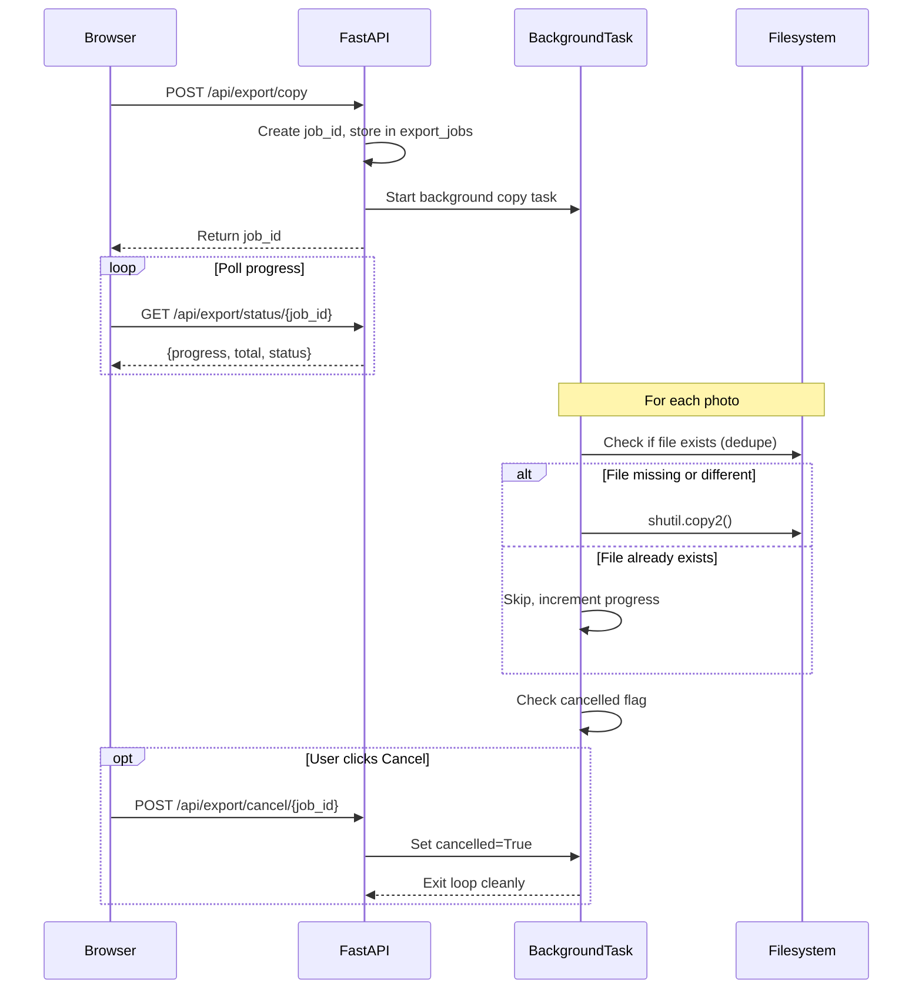

# Export Selected Photos - UI Implementation

## Export Options

| Mode | Output ||------|--------|| **Copy to Folder** | Photos copied to destination + manifest.json || **Share with Photographer** | .txt filename list + .zip of XMP sidecars || **Reset Selections** | Clears all starred/rejected in DB |

## Architecture - Cancellable Export with Deduplication




## Deduplication Logic

```python
def should_copy(src: Path, dest: Path) -> bool:
    if not dest.exists():
        return True
    # Same size = likely same file (fast check)
    if src.stat().st_size != dest.stat().st_size:
        return True
    return False  # Skip - already exported
```

Re-running export on same destination:

- Skips already-copied files (fast)
- Copies only new selections
- Updates manifest.json

## Backend Endpoints

| Endpoint | Method | Description ||----------|--------|-------------|| `/api/export/copy` | POST | Start async copy job, returns job_id || `/api/export/status/{job_id}` | GET | Get progress: {current, total, status, skipped} || `/api/export/cancel/{job_id}` | POST | Set cancellation flag || `/api/export/filenames` | GET | Download .txt with filename list || `/api/export/xmp` | GET | Download .zip of XMP sidecar files || `/api/reset-selections` | POST | Clear all starred/rejected flags |

## Job State Structure

```python
export_jobs = {
    "job-uuid": {
        "status": "running",  # running | complete | cancelled | error
        "progress": 45,
        "total": 284,
        "skipped": 12,        # Already existed (dedupe)
        "copied": 33,
        "cancelled": False,
        "destination": "/path/to/selects",
        "error": None
    }
}
```


## Frontend UI

```javascript
┌──────────────────────────────────────────────────────────┐
│  Export Photos                                       [x] │
├──────────────────────────────────────────────────────────┤
│                                                          │
│  📁 COPY TO FOLDER                                       │
│  ┌────────────────────────────────────────────────────┐  │
│  │ Destination: [~/Desktop/WeddingSelects          ]  │  │
│  │                                                    │  │
│  │ 284 selected photos • ~18.5 GB                     │  │
│  │ □ Include manifest.json                            │  │
│  │                                                    │  │
│  │ [████████████░░░░░░░░] 45/284 (12 skipped)         │  │
│  │                                                    │  │
│  │         [Cancel]  [Start Export]                   │  │
│  └────────────────────────────────────────────────────┘  │
│                                                          │
│  📤 SHARE WITH PHOTOGRAPHER                              │
│  ┌─────────────────────┐  ┌─────────────────────┐        │
│  │  📋 Filename List   │  │  📦 XMP Sidecars    │        │
│  │  Download .txt      │  │  Download .zip      │        │
│  └─────────────────────┘  └─────────────────────┘        │
│                                                          │
│  ──────────────────────────────────────────────────────  │
│  🔄 Reset All Selections                    [Reset...]   │
└──────────────────────────────────────────────────────────┘
```


## XMP Sidecar Format

```xml
<?xml version="1.0" encoding="UTF-8"?>
<x:xmpmeta xmlns:x="adobe:ns:meta/">
  <rdf:RDF xmlns:rdf="http://www.w3.org/1999/02/22-rdf-syntax-ns#">
    <rdf:Description rdf:about=""
      xmlns:xmp="http://ns.adobe.com/xap/1.0/"
      xmp:Rating="5"
      xmp:Label="Select"/>
  </rdf:RDF>
</x:xmpmeta>
```


## Files to Modify

1. **[server.py](server.py)** - Add 6 new endpoints + background task logic
2. **[static/index.html](static/index.html)** - New export modal markup
3. **[static/app.js](static/app.js)** - Export logic with polling + cancel

## Edge Cases Handled